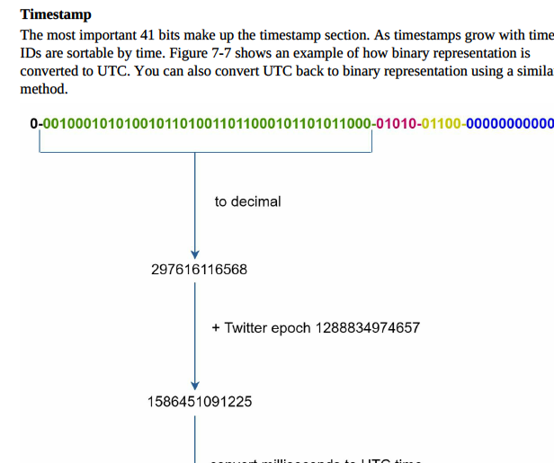

# Chapter 7: Design a Unique ID Generator in Distributed Systems

## Step 1: Understand the Problem and Establish Design Scope

The need to generate unique IDs in a distributed system is a common problem with many possible solutions. Each approach comes with its own set of trade-offs.

## Step 2: Propose High-Level Design and Get Buy-In

We've considered several strategies for generating unique IDs in distributed systems. They are:

### Multi-master Replication

**Definition:** This technique uses databases' auto_increment feature. Instead of incrementing the next ID by 1, we increase it by `k`, where `k` is the number of database servers in use. 

**Pros:**
- Solves some scalability issues as IDs can scale with the number of database servers.
- No need for coordination between servers so there won't be any synchronization issues.

**Cons:**
- Difficult to scale with multiple data centers.
- IDs do not increase with time across multiple servers.
- It doesn't scale well when a server is added or removed.

### Universally Unique Identifier (UUID)

**Definition:** UUID is a 128-bit number used to uniquely identify information in computer systems. The probability of collision is extremely low.

**Pros:**
- UUIDs can be generated independently without coordination between servers, making them simple to generate.
- The system is easy to scale as each server generates the IDs they consume.

**Cons:**
- UUIDs are 128 bits long, which exceeds our requirement of 64 bits.
- UUIDs do not increment with time.
- UUIDs can be non-numeric.

### Ticket Server

**Definition:** The idea behind a Ticket Server is to use the centralized auto_increment feature in a single database server.

**Pros:**
- Generates numeric IDs.
- Easy to implement and works for small to medium-scale applications.

**Cons:**
- Single point of failure. Single ticket server means if the ticket server goes down, all
systems that depend on it will face issues. To avoid a single point of failure, we can set up
multiple ticket servers. However, this will introduce new challenges such as data
synchronization.

### Twitter Snowflake Approach

**Definition:** The Snowflake service generates IDs with different sections, including a timestamp, datacenter ID, machine ID, and sequence number.

**Pros:**
- Numeric IDs.
- It works well for distributed systems with multiple datacenters and machines.

**Cons:**
- Not specifically mentioned.

Each section is explained below.
• Sign bit: 1 bit. It will always be 0. This is reserved for future uses. It can potentially be
used to distinguish between signed and unsigned numbers.
• Timestamp: 41 bits. Milliseconds since the epoch or custom epoch. We use Twitter
snowflake default epoch 1288834974657, equivalent to Nov 04, 2010, 01:42:54 UTC.
• Datacenter ID: 5 bits, which gives us 2 ^ 5 = 32 datacenters.
• Machine ID: 5 bits, which gives us 2 ^ 5 = 32 machines per datacenter.
• Sequence number: 12 bits. For every ID generated on that machine/process, the sequence
number is incremented by 1. The number is reset to 0 every millisecond.

## Step 3: Design Deep Dive

After careful consideration, we have chosen the Twitter Snowflake approach. 

The maximum timestamp that can be represented in 41 bits is 2^41 - 1 = 2199023255551 milliseconds (ms), which gives us about 69 years. This is calculated as 2199023255551 ms / 1000 (seconds) / 60 (minutes) / 60 (hours) / 24 (days) / 365 (years). This means the ID generator will work for 69 years, and having a custom epoch time

