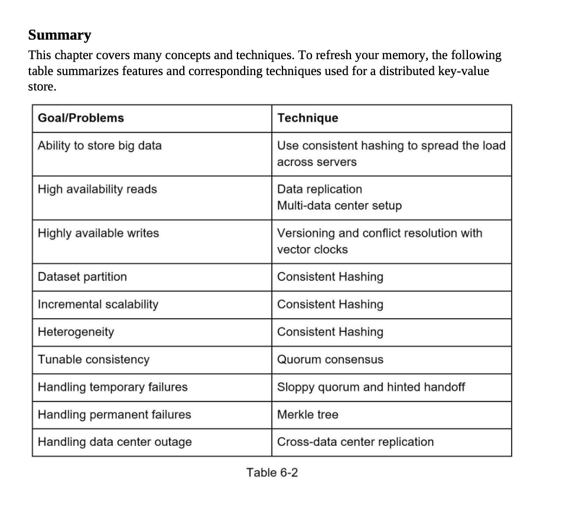

# CAP Theorem in Distributed Systems

The **CAP theorem**, also known as **Brewer's theorem**, claims that it is impossible for a distributed computer system to simultaneously provide all three of the following guarantees:

- **Consistency:** All nodes have the same data.
- **Availability:** All nodes are able to respond to requests.
- **Partition Tolerance:** The system continues to function even if some of the nodes are unavailable.

A distributed system can have at most two of these three properties.

## Real-world Applications

### Social Media Platforms

Social media platforms, as distributed systems, need to prioritize **availability**. They must decide between high availability and consistency.

### E-commerce Websites

E-commerce websites, on the other hand, need to be both highly available and **partition tolerant**. A trade-off between availability and partition tolerance is needed.

## MongoDB and the CAP Theorem

**MongoDB** falls under the CP (consistency and partition tolerance) category of the CAP theorem, prioritizing consistency over availability.

### How MongoDB Achieves Consistency

MongoDB uses a master-slave replication model to achieve consistency. The master node accepts writes, and the slave nodes handle reading data.

### When to Use MongoDB

MongoDB is a good choice for applications that require strong consistency, like financial applications and e-commerce applications. But, it's not ideal for applications that require high availability, like social media applications and gaming applications.

### Pros and Cons of MongoDB

**Pros:**

- Strong consistency
- Scalable
- Flexible
- Easy to use

**Cons:**

- Not as available as some other databases
- Not as efficient as some other databases
- Can be complex to manage

In summary, MongoDB is well-suited for applications that demand strong consistency but are less concerned about availability.

# Replication gives high availability but causes inconsistencies among replicas. Versioning and vector locks are used to solve inconsistency problems.

Replication gives high availability but causes inconsistencies among replicas. Versioning and vector locks are used to solve inconsistency problems. Versioning means treating each data modification as a new immutable version of data. Before we talk about versioning, let us use an example to explain how inconsistency happens:

As shown in Figure 6-7, both replica nodes n1 and n2 have the same value. Let us call this value the original value. Server 1 and server 2 get the same value for get("name") operation. Next, server 1 changes the name to "johnSanFrancisco", and server 2 changes the name to "johnNewYork" as shown in Figure 6-8. These two changes are performed simultaneously. Now, we have conflicting values, called versions v1 and v2.

In this example, the original value could be ignored because the modifications were based on it. However, there is no clear way to resolve the conflict of the last two versions. To resolve this issue, we need a versioning system that can detect conflicts and reconcile conflicts. A vector clock is a common technique to solve this problem. Let us examine how vector clocks work.

A vector clock is a [server, version] pair associated with a data item. It can be used to check if one version precedes, succeeds, or is in conflict with others.

Assume a vector clock is represented by D([S1, v1], [S2, v2], ..., [Sn, vn]), where D is a data item, v1 is a version counter, and s1 is a server number, etc. If data item D is written to server Si, the system must perform one of the following tasks:
- Increment vi if [Si, vi] exists.
- Otherwise, create a new entry [Si, 1].

The above abstract logic is explained with a concrete example as shown in Figure 6-9.
1. A client writes a data item D1 to the system, and the write is handled by server Sx, which now has the vector clock D1[(Sx, 1)].
2. Another client reads the latest D1, updates it to D2, and writes it back. D2 descends from D1, so it overwrites D1. Assume the write is handled by the same server Sx, which now has vector clock D2([Sx, 2]).
3. Another client reads the latest D2, updates it to D3, and writes it back. Assume the write is handled by server Sy, which now has vector clock D3([Sx, 2], [Sy, 1])).
4. Another client reads the latest D2, updates it to D4, and writes it back. Assume the write...

p96-99

