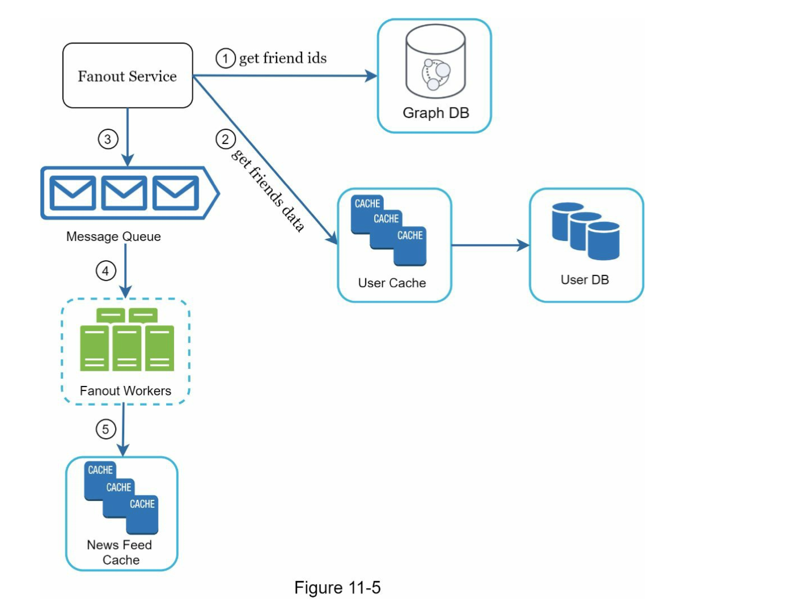

## Chapter 11 - News Feed System Design

### Clarification Questions

- Is this a mobile app? Or a web app? Or both?
- What are the important features?
- Is the news feed sorted by reverse chronological order or any particular order such as topic scores?
- How many friends can a user have?
- What is the traffic volume?
- Can feed contain images, videos, or just text?

### Step 2 - High-Level Design

Two main flows:
1. **Feed publishing**: When a user publishes a post, the data is written into cache and database. The post is then populated to her friends' news feed.
2. **Newsfeed building**: For simplicity, we assume the news feed is built by aggregating friends' posts in reverse chronological order.

#### Newsfeed APIs
- **Feed publishing API**:
  - HTTP POST request to server.
  - `POST /v1/me/feed`
  - Params: content (text of the post), auth_token (used to authenticate API requests).
- **Newsfeed retrieval API**:
  - HTTP GET request to server.
  - `GET /v1/me/feed`
  - Params: auth_token (used to authenticate API requests).

#### Feed Publishing

- User makes a post through API.
- Load balancer distributes traffic to web servers.
- Web servers redirect traffic to different internal services.
- Post service persists post in the database and cache.
- Fanout service pushes new content to friends' news feed.
- Notification service informs friends about new content and sends out push notifications.

#### Newsfeed Building

- User sends a request to retrieve her news feed.
- Load balancer redirects traffic to web servers.
- Web servers route requests to newsfeed service.
- Newsfeed service fetches news feed from the cache.

### Step 3 - Design Deep Dive

#### Feed Publishing Deep Dive

- **Web servers**:
  - Enforce authentication and rate-limiting.
- **Fanout service**:
  - Fanout is the process of delivering a post to all friends.
  - Two types of fanout models are: fanout on write (also called push model) and fanout on read (also called pull model).
  - **Fanout on write**:
    - News feed is pre-computed during write time.
    - Pros: The news feed is generated in real-time. Fetching news feed is fast because it is pre-computed.
    - Cons: Fetching the friend list and generating news feeds for all of them are slow. It wastes computing resources for inactive users.
  - **Fanout on read**:
    - News feed is generated during read time.
    - Pros: It doesn't waste computing resources for inactive users.
    - Cons: Fetching the news feed is slow.
  - Hybrid approach is adopted to get benefits of both approaches and avoid pitfalls in them.
chapter11NewsFeed.png

1. A user sends a request to retrieve her news feed. The request looks like this: /v1/me/feed 2. The load balancer redistributes requests to web servers.
3. Web servers call the news feed service to fetch news feeds.
4. News feed service gets a list post IDs from the news feed cache.
5. A user’s news feed is more than just a list of feed IDs. It contains username, profile picture, post content, post image, etc. Thus, the news feed service fetches the complete user and post objects from caches (user cache and post cache) to construct the fully hydrated news feed.
6. The fully hydrated news feed is returned in JSON format back to the client for rendering.

Cache is extremely important for a news feed system. We divide the cache tier into 5 layers as shown in Figure 11-8.
 • News Feed: It stores IDs of news feeds.
• Content: It stores every post data. Popular content is stored in hot cache.
• Social Graph: It stores user relationship data.
• Action: It stores info about whether a user liked a post, replied a post, or took other actions on a post.
• Counters: It stores counters for like, reply, follower, following, etc.

Like any system design interview questions, there is no perfect way to design a system. Every company has its unique constraints, and you must design a system to fit those constraints. Understanding the tradeoffs of your design and technology choices are important. If there are a few minutes left, you can talk about scalability issues. To avoid duplicated discussion, only high-level talking points are listed below.

Vertical scaling vs Horizontal scaling:

Vertical Scaling (scale-up): It involves adding more resources (CPU, RAM, storage etc.) to a single node in a system, such as a server or a database, to increase its performance. This method has limitations due to the maximum available capacity of a single machine.
Horizontal Scaling (scale-out): It involves adding more nodes (servers, databases, etc.) to a system. This method improves performance by distributing the load across multiple nodes.
SQL vs NoSQL:

SQL: These are relational databases that have a predefined schema and use Structured Query Language for defining and manipulating the data. Examples: MySQL, PostgreSQL, Oracle Database.
NoSQL: These are non-relational databases that can store and retrieve data in a variety of ways that are not based on tabular relations used in relational databases. They're often used when dealing with large sets of distributed data. Examples: MongoDB, Cassandra, Redis.
Master-slave replication: It's a type of database replication method where one database server (the master) maintains the primary copy of data, and one or more other servers (the slaves) maintain secondary copies of the data. The master is the primary node for all write operations, and it propagates the changes to the slave nodes.

Read replicas: These are read-only copies of your master database. Creating one or more read replicas of your master database, and serving read traffic from the multiple copies, can increase the total capacity to serve read traffic.

Consistency models: Consistency models determine how changes made to data in a database are propagated to replicas. The two extremes are:

Strong Consistency: Any read request will always return the most recent write.
Eventual Consistency: Reads may return older writes, with the guarantee that if no new updates are made to the object, eventually all accesses will return the last updated value.
Database sharding: It's a type of database partitioning that separates very large databases into smaller, faster, more easily managed parts called data shards.

Keep web tier stateless: Stateless means that each request from a client to the server must contain all the information needed to understand and process the request. This is critical in a distributed computing environment as it allows you to freely distribute requests among multiple servers.

Cache data as much as you can: Caching involves storing data in a temporary storage area (the cache) so that future requests for that data can be served faster. The data stored in a cache might be the result of a computation, or a copy of data stored elsewhere.

Support multiple data centers: Deploying your application across multiple data centers can provide disaster recovery, data locality, and improved availability.

Lose couple components with message queues: Message queues provide an asynchronous communications protocol, meaning that the sender and receiver of the message do not need to interact with the message queue at the same time. This can help to decouple, distribute and scale your applications.

Monitor key metrics: Monitoring key metrics of a system is essential to understand its performance and reliability. For instance, Query Per Second (QPS) during peak hours and latency while users refreshing their news feed are important metrics to monitor in a news feed system.