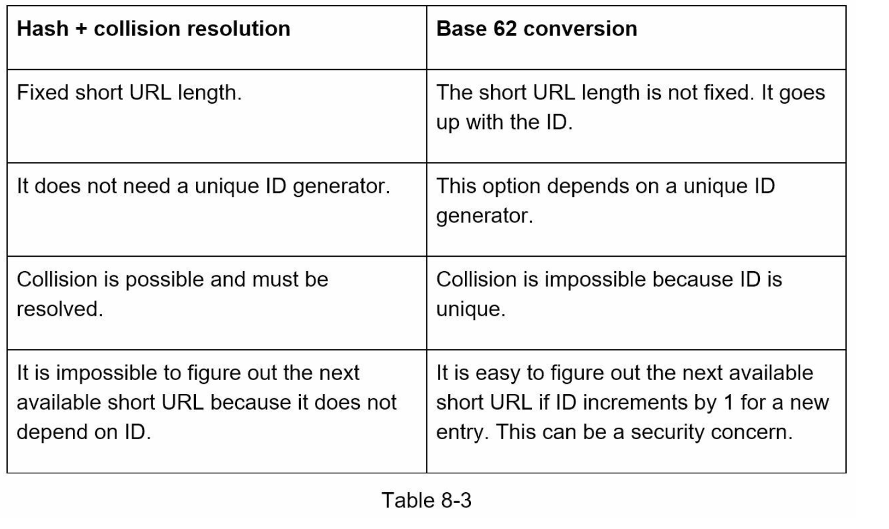

# Chapter 8: Design a URL Shortener

## Step 1 - Understand the problem and establish design scope

- Two main use cases:
  1. URL shortening: long URL => shorter URL
  2. URL redirecting: short URL => redirect to original URL
- Need to handle 100 million URLs per day, read to write ratio is 10:1, and the system will run for 10 years, supporting up to 365 billion URLs in total.

## Step 2 - Propose high-level design and get buy-in

- Two necessary API endpoints: one for URL shortening and one for URL redirecting.
- URL redirecting can be done with 301 (permanent) or 302 (temporary) HTTP redirects.
- URL shortening can be implemented using a hash function that maps a long URL to a short URL.

## Step 3 - Design deep dive

- Data model involves storing <shortURL, longURL> mapping in a relational database.
- Hash function can be implemented in two ways:
  1. Hash + collision resolution
  2. Base 62 conversion
- URL shortening flow involves checking if the longURL already exists in the database, generating a new unique ID if it doesn't, and creating a new database row.

## Step 4 - Wrap up

- Additional considerations include rate limiting, web server scaling, database scaling, analytics, and reliability/availability/consistency of the system.

